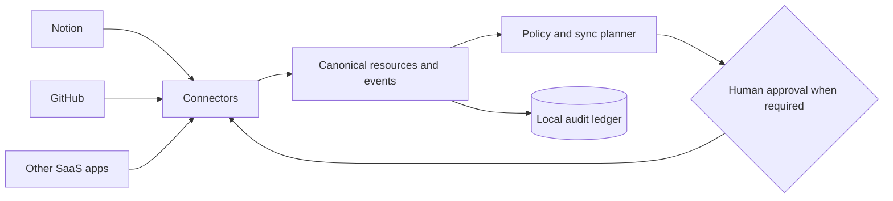

# The People’s Grimoire

> A user-owned connective tissue for the tools where we work, think, build, and remember.

Most SaaS applications are excellent organs and terrible organisms. They each hold a fragment of our work and memory, but they rarely understand one another without brittle automations, duplicated data, and another platform demanding custody of everything.

**The People’s Grimoire** is an open-source framework for connecting those fragments into a coherent, governable whole.

It is designed to be:

- **User-owned** — your data, mappings, policies, and credentials remain under your control.
- **Local-first and self-hostable** — no mandatory central service becomes the new owner of your digital life.
- **Connector-based** — each SaaS application is an adapter, not a dependency baked into the core.
- **Event-driven** — changes become explicit, traceable events rather than invisible background magic.
- **Policy-governed** — every synchronization can be filtered, approved, reversed, or refused.
- **Human-accountable** — AI may help interpret and coordinate, but people retain authority over consequential actions.

## The idea

The Grimoire treats a person’s digital ecosystem as a living system:

- **Connectors** are its senses and nerves.
- **The canonical schema** is its shared language.
- **The event ledger** is its memory.
- **Policies and permissions** are its boundaries and immune system.
- **Recipes** are learned patterns of coordination.
- **The person or community operating it** remains its author and conscience.

## First organism: Notion ↔ GitHub

The founding implementation connects Notion and GitHub without pretending they are interchangeable.

The initial recipes will explore flows such as:

- GitHub issues becoming linked Notion tasks or knowledge records.
- Notion decisions becoming versioned Architecture Decision Records.
- Merged pull requests updating project history in Notion.
- Shared project identities connecting repositories, pages, tasks, decisions, and releases.

Bidirectional synchronization is **field-specific**, not blind. Every recipe declares which system is authoritative for each field, how conflicts are handled, and whether a person must approve a proposed change.

## Public commons, private instance

This repository contains the public protocol, runtime, connector interfaces, documentation, examples, and sanitized test fixtures.

A real deployment keeps personal configuration and private mappings outside this public repository. Credentials belong in an environment, operating-system keychain, or dedicated secret manager—**not in Git, even when the repository is private**.

The project will never require contributors to publish personal content in order to reproduce a bug or demonstrate a connector.

## Project status

**Foundational / pre-alpha.** The architecture, trust boundaries, canonical event model, and first Notion–GitHub recipe are being established before production credentials or irreversible writes are introduced.

The next foundation commit will add:

- architecture and privacy documentation;
- governance and contribution guidelines;
- a Python reference runtime;
- canonical event schemas;
- sanitized example recipes;
- the first public implementation roadmap.

## Principles

1. **Sovereignty before convenience.**
2. **Interoperability before platform capture.**
3. **Explicit provenance before seamless-looking magic.**
4. **Reversible plans before irreversible actions.**
5. **Minimum necessary access before broad permissions.**
6. **Shared protocols before one privileged interface.**
7. **Unity without erasing difference.**

## Participation

The People’s Grimoire is intended as a public commons: useful to individual knowledge workers, small teams, open-source communities, and anyone tired of their digital life being divided into proprietary islands.

The repository is being built in public from its first architectural decisions. Contributions will be welcomed once the foundation documents and connector contract are merged.
