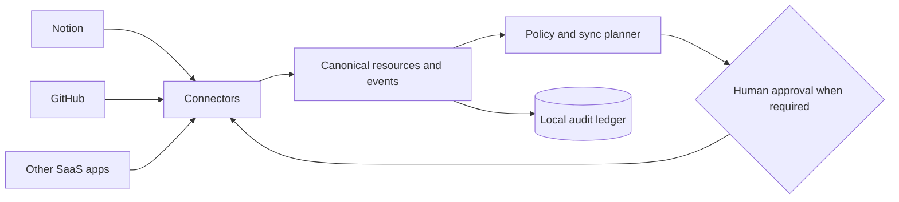

# The People’s Grimoire

> **Automating the means of production since 2026.**
>
> A user-owned connective tissue for the tools where we work, think, build, and remember.

The People’s Grimoire is the first step toward **fully automated luxury gay space communism**.

**Not a meme. A mantra.**

The project is also a **bodhisattva vow expressed through infrastructure**, grounded in active compassion. Its measure is not power for its own sake, but whether ordinary people become less powerless. Read the [founding vow](MANIFESTO.md#founding-vow).

In practical terms, that means reclaiming interoperability and automation as public capabilities: reducing drudgery, resisting platform capture, returning time and authority to people, and building digital infrastructure that can be inspected, adapted, hosted, and governed by the communities it serves. Read the [Manifesto](MANIFESTO.md).

Most SaaS applications are excellent organs and terrible organisms. Each holds a fragment of our work and memory, but they rarely understand one another without brittle automations, duplicated data, and another platform demanding custody of everything.

**The People’s Grimoire** is an open-source framework for connecting those fragments into a coherent, governable whole.

> [!WARNING]
> This project is **pre-alpha**. The current runtime is a safe architectural scaffold, not a production synchronization service. It performs dry-runs and in-memory demonstrations only.

## What makes it different

- **User-owned:** data, mappings, policies, and credentials remain under the operator’s control.
- **Local-first and self-hostable:** no mandatory central service becomes the new owner of a person’s digital life.
- **Connector-based:** every SaaS application is an adapter, not a dependency embedded in the core.
- **Event-driven:** changes become explicit, traceable events instead of invisible background magic.
- **Policy-governed:** every proposed synchronization can be filtered, approved, reversed, or refused.
- **Human-accountable:** AI may interpret, draft, and coordinate, but people retain authority over consequential actions.
- **Plural by design:** unity comes from shared language and relationships, not from flattening every tool into the same shape.
- **Commons-oriented:** reusable protocols and coordination patterns should circulate instead of becoming another layer of rent.

## The organism

- **Connectors** are its senses and nerves.
- **The canonical schema** is its shared language.
- **The event ledger** is its memory.
- **Policies and permissions** are its boundaries and immune system.
- **Recipes** are learned patterns of coordination.
- **The person or community operating it** remains its author and conscience.



## First organism: Notion ↔ GitHub

The founding implementation connects Notion and GitHub without pretending they are interchangeable.

The first recipes will explore:

- GitHub issues becoming linked Notion tasks or knowledge records.
- Notion decisions becoming versioned Architecture Decision Records.
- Merged pull requests updating project history in Notion.
- Shared project identities connecting repositories, pages, tasks, decisions, and releases.

Bidirectional synchronization is **field-specific**, not blind. Every recipe declares which system is authoritative, how identities are linked, how conflicts are held, and whether a person must approve the proposed change.

Read the [Notion ↔ GitHub MVP design](docs/connectors/NOTION_GITHUB_MVP.md).

## Reference runtime

The repository includes a deliberately small Python runtime that demonstrates the plan/apply boundary.

```bash
python -m venv .venv
source .venv/bin/activate
python -m pip install -e ".[dev]"

# Produces a sanitized dry-run. No SaaS API is contacted.
grimoire demo

# Applies the same plan only to an in-memory recording connector.
grimoire demo --apply

pytest
```

The runtime currently provides connector-neutral models, deterministic event and action identifiers, explicit proposed actions, dry-run behavior, per-action approval gates, an append-only in-memory ledger, connector capability enforcement, and content-minimizing structured observability. It intentionally contains no production Notion or GitHub API client yet.

### Trust substrate

Before a connector can execute an action, its manifest must declare the exact action, resource type, protocol compatibility, and required permissions. The active credential must satisfy that declaration, and a recipe cannot widen it. Undeclared actions and missing scopes fail before approval or execution.

Operational records use deny-by-default serialization. Core secrets are always redacted, private identifiers become keyed fingerprints, unknown payload fields are omitted, and exception messages are replaced by correlated diagnostic identifiers. Debug mode cannot disable those controls.

Read the [connector capability contract](docs/connectors/CAPABILITY_MANIFEST.md) and [safe observability model](docs/OBSERVABILITY.md).

## Public commons, private instance

This repository contains public protocols, runtime code, connector contracts, documentation, schemas, and sanitized fixtures.

A real deployment keeps private configuration and identity mappings outside this repository. Credentials belong in environment variables, an operating-system keychain, or a dedicated secret manager—**not in Git, even when the repository is private**.

Never commit tokens, private content, production payloads, unredacted logs, workspace inventories, or mappings that expose the structure of a person’s digital life.

## Read next

- [Manifesto](MANIFESTO.md)
- [Architecture](docs/ARCHITECTURE.md)
- [Privacy and Trust](docs/PRIVACY.md)
- [Connector Capability Manifest](docs/connectors/CAPABILITY_MANIFEST.md)
- [Safe Observability](docs/OBSERVABILITY.md)
- [Roadmap](ROADMAP.md)
- [Governance](GOVERNANCE.md)
- [Contributing](CONTRIBUTING.md)
- [Security](SECURITY.md)

## Principles

1. **Sovereignty before convenience.**
2. **Interoperability before platform capture.**
3. **Automation should return time and power to people.**
4. **Explicit provenance before seamless-looking magic.**
5. **Reversible plans before irreversible actions.**
6. **Minimum necessary access before broad permissions.**
7. **Shared protocols before one privileged interface.**
8. **The commons before artificial scarcity.**
9. **Unity without erasing difference.**
10. **Compassion is an engineering requirement, not a branding layer.**
11. **No liberation may depend on another person’s disposability.**

The People’s Grimoire is licensed under the [Apache License 2.0](LICENSE).

**Tech workers of the world, unite.**

**May all beings be liberated from the suffering of late-stage techno-dystopian capitalism.**
