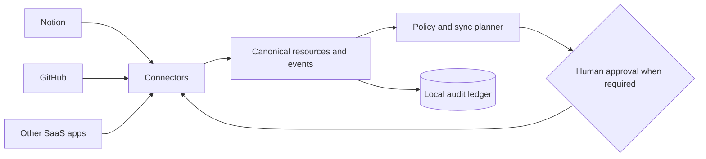

# The People’s Grimoire
>
> A user-owned connective tissue for the tools where we work, think, build, and remember.

> reclaiming interoperability and automation as public capabilities: reducing drudgery, resisting platform capture, returning time and authority to people, and building digital infrastructure that can be inspected, adapted, hosted, and governed by the communities it serves.

Most SaaS applications are excellent organs and terrible organisms. Each holds a fragment of our work and memory, but they rarely understand one another without brittle automations, duplicated data, and another platform demanding custody of everything.

**The People’s Grimoire** is an open-source framework for connecting those fragments into a coherent, governable whole.

> [!WARNING]
> This project is **pre-alpha**. The current runtime is a safe architectural scaffold, not a production synchronization service. The conversational bootstrap kit produces validated plans and synthetic examples, but live reads and writes depend on the capabilities exposed by the operator’s chatbot host and connected providers.

## Install your own Grimoire

The primary installer is a guided conversation. For the default GitHub + Notion setup, the onboarding ritual is deliberately simple:

1. Connect **GitHub** to your chatbot through the host’s official integration or connector UI.
2. Connect **Notion** the same way.
3. Start a new conversation and paste the [one-prompt installer](INSTALL_PROMPT.md).
4. Let the chatbot locate this public repository, read the canonical [`BOOTSTRAP.md`](BOOTSTRAP.md), and begin readiness plus read-only discovery.
5. Review the history-derived topology and bootstrap plan before approving any durable writes.
6. After approval, let the chatbot build or reconcile the private GitHub core and Notion semantic control plane, then verify fresh-host continuity.

**You do not need to clone or download this repository** when the chatbot can read the public GitHub project. The install prompt is only an ignition key; the repository remains the source of truth for the bootstrap protocol.

The installer does not begin with a universal second-brain taxonomy. It inspects only the chat, notebook, file, Notion, and GitHub sources you approve; looks for recurring domains, artifact types, workflows, and existing canonical objects; and proposes a structure shaped around the life and work you actually have.

GitHub and Notion are the first carrier pair. Profiles and plans refer to abstract roles—cognition, semantic memory, versioned artifacts, and secret store—so compatible providers can be replaced later without rebuilding the domain model.

Read [Install Your Grimoire](INSTALL.md) for the full walkthrough, or go straight to the [one-prompt installer](INSTALL_PROMPT.md).

## Core design philosophy: continuity over interface

**The Grimoire is not the chatbot.** The chatbot is the current cognition and orchestration interface into a durable, user-owned system.

A successful Grimoire must preserve enough identity, topology, provenance, routing, authority rules, operating conventions, and active-work context outside any single conversation or model that a capable replacement AI can enter with no prior chat history, inspect the operator-authorized durable layers, and continue the operator’s work intelligently and traceably.

This creates a hard architectural requirement: the AI host must be replaceable without requiring the operator to reconstruct their knowledge system from memory or from old chats.

The project calls this the **fresh-host continuity test**. A fresh capable AI should be able to recover what the instance is, where canonical knowledge and artifacts live, what work is active, what policies apply, and what unresolved state must be preserved using the public bootstrap protocol plus the operator’s authorized durable carriers.

This does not require different models to think identically. It requires the **state of the person’s system** to survive the interface that happens to be reasoning over it today.

See [ADR 0006: Continuity Must Outlive the AI Interface](docs/adr/0006-continuity-over-interface.md).

## What makes it different

- **User-owned:** data, mappings, policies, and credentials remain under the operator’s control.
- **Local-first and self-hostable:** no mandatory central service becomes the new owner of a person’s digital life.
- **History-shaped:** onboarding derives durable domains from approved recurring patterns instead of imposing a generic folder tree.
- **Connector-based:** every SaaS application is an adapter, not a dependency embedded in the core.
- **Carrier-neutral:** semantic roles remain stable when providers are replaced.
- **AI-portable:** durable continuity does not depend on one chatbot, model, or conversation history.
- **Event-driven:** changes become explicit, traceable events instead of invisible background magic.
- **Policy-governed:** every proposed synchronization can be filtered, approved, reversed, or refused.
- **Human-accountable:** AI may interpret, draft, and coordinate, but people retain authority over consequential actions.
- **Plural by design:** unity comes from shared language and relationships, not from flattening every tool into the same shape.
- **Commons-oriented:** reusable protocols and coordination patterns should circulate instead of becoming another layer of rent.

## The organism

- **Connectors** are its senses and nerves.
- **The canonical schema** is its shared language.
- **The event ledger** is its memory.
- **Policies and permissions** are its boundaries and immune system.
- **Recipes** are learned patterns of coordination.
- **The bootstrap profile** is its first map of the operator’s actual ecology.
- **The person or community operating it** remains its author and conscience.



## First organism: Notion ↔ GitHub

The founding implementation connects Notion and GitHub without pretending they are interchangeable.

The first recipes will explore:

- GitHub issues becoming linked Notion tasks or knowledge records.
- Notion decisions becoming versioned Architecture Decision Records.
- Merged pull requests updating project history in Notion.
- Shared project identities connecting repositories, pages, tasks, decisions, and releases.

Bidirectional synchronization is **field-specific**, not blind. Every recipe declares which system is authoritative, how identities are linked, how conflicts are held, and whether a person must approve the proposed change.

Read the [Notion ↔ GitHub MVP design](docs/connectors/NOTION_GITHUB_MVP.md).

## Conversational bootstrap

The bootstrap system is split into portable layers:

- [`INSTALL_PROMPT.md`](INSTALL_PROMPT.md) — the small copy/paste ignition prompt.
- [`BOOTSTRAP.md`](BOOTSTRAP.md) — executable installer protocol for a capable chatbot.
- [`bootstrap/blueprints/`](bootstrap/blueprints/) — provider-neutral private-core and control-plane structures.
- [`bootstrap/carriers/`](bootstrap/carriers/) — provider bindings and degraded-mode requirements.
- [`schemas/grimoire-bootstrap-profile.schema.json`](schemas/grimoire-bootstrap-profile.schema.json) — approved discovery and topology contract.
- [`schemas/grimoire-bootstrap-plan.schema.json`](schemas/grimoire-bootstrap-plan.schema.json) — reviewable plan/apply contract.
- [`examples/bootstrap/`](examples/bootstrap/) — synthetic validated fixtures.

The chatbot is an interface to the protocol, not the canonical owner of the instance. A host without direct provider writes can still produce a portable plan and manual work orders.

Read the [Bootstrap Protocol architecture](docs/BOOTSTRAP_PROTOCOL.md).

## Reference runtime

The repository includes a deliberately small Python runtime that demonstrates the plan/apply boundary.

```bash
python -m venv .venv
source .venv/bin/activate
python -m pip install -e ".[dev]"

# Produces a sanitized dry-run. No SaaS API is contacted.
grimoire demo

# Applies the same plan only to an in-memory recording connector.
grimoire demo --apply

pytest
```

The runtime currently provides connector-neutral models, deterministic event and action identifiers, explicit proposed actions, dry-run behavior, per-action approval gates, an append-only in-memory ledger, connector capability enforcement, and content-minimizing structured observability. It intentionally contains no production Notion or GitHub API client yet.

### Trust substrate

Before a connector can execute an action, its manifest must declare the exact action, resource type, protocol compatibility, and required permissions. The active credential must satisfy that declaration, and a recipe cannot widen it. Undeclared actions and missing scopes fail before approval or execution.

Operational records use deny-by-default serialization. Core secrets are always redacted, private identifiers become keyed fingerprints, unknown payload fields are omitted, and exception messages are replaced by correlated diagnostic identifiers. Debug mode cannot disable those controls.

Read the [connector capability contract](docs/connectors/CAPABILITY_MANIFEST.md) and [safe observability model](docs/OBSERVABILITY.md).

## Public commons, private instance

This repository contains public protocols, runtime code, connector contracts, bootstrap contracts, documentation, schemas, and sanitized fixtures.

A real deployment keeps its approved bootstrap profile, private topology, configuration, and identity mappings outside this public repository. Credentials belong in environment variables, an operating-system keychain, or a dedicated secret manager—**not in Git, even when the repository is private**.

Never commit tokens, private content, production payloads, unredacted logs, raw history exports, workspace inventories, or mappings that expose the structure of a person’s digital life.

## Read next

- [Install Your Grimoire](INSTALL.md)
- [One-Prompt Installer](INSTALL_PROMPT.md)
- [Bootstrap Steward](BOOTSTRAP.md)
- [Bootstrap Protocol](docs/BOOTSTRAP_PROTOCOL.md)
- [Manifesto](MANIFESTO.md)
- [Architecture](docs/ARCHITECTURE.md)
- [Privacy and Trust](docs/PRIVACY.md)
- [Connector Capability Manifest](docs/connectors/CAPABILITY_MANIFEST.md)
- [Safe Observability](docs/OBSERVABILITY.md)
- [Roadmap](ROADMAP.md)
- [Governance](GOVERNANCE.md)
- [Contributing](CONTRIBUTING.md)
- [Security](SECURITY.md)

## Principles

1. **Sovereignty before convenience.**
2. **Interoperability before platform capture.**
3. **Automation should return time and power to people.**
4. **Explicit provenance before seamless-looking magic.**
5. **Reversible plans before irreversible actions.**
6. **Minimum necessary access before broad permissions.**
7. **Shared protocols before one privileged interface.**
8. **The commons before artificial scarcity.**
9. **Unity without erasing difference.**
10. **Compassion is an engineering requirement, not a branding layer.**
11. **No liberation may depend on another person’s disposability.**
12. **Continuity must outlive the interface.**

The People’s Grimoire is licensed under the [Apache License 2.0](LICENSE).
