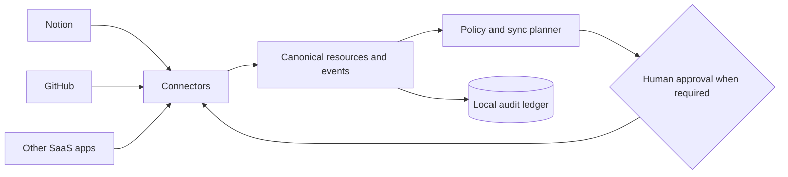

# The People’s Grimoire

> A user-owned connective tissue for the tools where we work, think, build, and remember.

Most SaaS applications are excellent organs and terrible organisms. Each holds a fragment of our work and memory, but they rarely understand one another without brittle automations, duplicated data, and another platform demanding custody of everything.

**The People’s Grimoire** is an open-source framework for connecting those fragments into a coherent, governable whole.

> [!WARNING]
> This project is **pre-alpha**. The current runtime validates trust manifests and provides safe dry-run and in-memory demonstrations. It is not a production synchronization service and does not yet include live Notion or GitHub API clients.

## What makes it different

- **User-owned:** data, mappings, policies, and credentials remain under the operator’s control.
- **Local-first and self-hostable:** no mandatory central service becomes the new owner of a person’s digital life.
- **Connector-based:** every SaaS application is an adapter, not a dependency embedded in the core.
- **Event-driven:** changes become explicit, traceable events instead of invisible background magic.
- **Policy-governed:** every proposed synchronization can be filtered, approved, reversed, or refused.
- **Human-accountable:** AI may interpret, draft, and coordinate, but people retain authority over consequential actions.
- **Plural by design:** unity comes from shared language and relationships, not from flattening every tool into the same shape.

## The organism

- **Connectors** are its senses and nerves.
- **The canonical schema** is its shared language.
- **The event ledger** is its memory.
- **Policies and permissions** are its boundaries and immune system.
- **Recipes** are learned patterns of coordination.
- **The person or community operating it** remains its author and conscience.



## First organism: Notion ↔ GitHub

The founding implementation connects Notion and GitHub without pretending they are interchangeable.

The first recipes will explore:

- GitHub issues becoming linked Notion tasks or knowledge records.
- Notion decisions becoming versioned Architecture Decision Records.
- Merged pull requests updating project history in Notion.
- Shared project identities connecting repositories, pages, tasks, decisions, and releases.

Bidirectional synchronization is **field-specific**, not blind. Every recipe declares which system is authoritative, how identities are linked, how conflicts are held, and whether a person must approve the proposed change.

Read the [Notion ↔ GitHub MVP design](docs/connectors/NOTION_GITHUB_MVP.md).

## Reference runtime

The repository includes a deliberately small Python runtime that demonstrates the plan/apply boundary and validates typed trust manifests.

```bash
python -m venv .venv
source .venv/bin/activate
python -m pip install -e ".[dev]"

# Produces a sanitized dry-run. No SaaS API is contacted.
grimoire demo

# Applies the same plan only to an in-memory recording connector.
grimoire demo --apply

# Validates synthetic connector, instance, and artifact manifests.
grimoire validate examples/manifests

pytest
```

The runtime currently provides connector-neutral models, deterministic event and action identifiers, explicit proposed actions, dry-run behavior, per-action approval gates, an append-only in-memory ledger, typed manifest schemas, cross-document capability checks, and likely inline-secret detection. It intentionally contains no production Notion or GitHub API client yet.

## Trust manifests

Before an adapter receives real credentials, its declared powers should be inspectable.

- A **connector manifest** declares supported resources, capability effects, minimum scopes, reversibility, event behavior, and redaction defaults.
- An **instance manifest** privately selects capabilities, resource allowlists, approval policy, and credential references.
- An **artifact manifest** gives a durable logical object stable identity and assigns canonical authority by semantic concern.

The validator rejects mismatched effects, unknown enabled capabilities, inline credential-shaped values, dangling authority references, and enabled write or publication capabilities that the instance policy forbids.

Read [Trust Manifests](docs/MANIFESTS.md), the [Connector Contract](docs/CONNECTOR_CONTRACT.md), and [Canonical Homes and Authority by Concern](docs/concepts/CANONICAL_HOMES.md).

## Public commons, private instance

This repository contains public protocols, runtime code, connector contracts, documentation, schemas, and sanitized fixtures.

A real deployment keeps private configuration and identity mappings outside this repository. Credentials belong in environment variables, an operating-system keychain, or a dedicated secret manager—**not in Git, even when the repository is private**.

Never commit tokens, private content, production payloads, unredacted logs, workspace inventories, or mappings that expose the structure of a person’s digital life.

## Standards posture

The project prefers composable public standards over a private integration universe:

- JSON Schema Draft 2020-12 for machine-readable contracts;
- CloudEvents-compatible envelopes at event transport boundaries;
- OpenAPI descriptions where an HTTP connector surface is appropriate;
- OAuth 2.0 and OpenID Connect with least-privilege delegated authorization; and
- an optional Model Context Protocol surface for AI hosts.

MCP is a northbound interface, not the internal data model. The core must remain usable from a CLI, local UI, service, or automation client that does not involve an LLM.

## Read next

- [Architecture](docs/ARCHITECTURE.md)
- [Privacy and Trust](docs/PRIVACY.md)
- [Trust Manifests](docs/MANIFESTS.md)
- [Connector Contract](docs/CONNECTOR_CONTRACT.md)
- [Canonical Homes and Authority by Concern](docs/concepts/CANONICAL_HOMES.md)
- [Roadmap](ROADMAP.md)
- [Governance](GOVERNANCE.md)
- [Contributing](CONTRIBUTING.md)
- [Security](SECURITY.md)

## Principles

1. **Sovereignty before convenience.**
2. **Interoperability before platform capture.**
3. **Explicit provenance before seamless-looking magic.**
4. **Reversible plans before irreversible actions.**
5. **Minimum necessary access before broad permissions.**
6. **Shared protocols before one privileged interface.**
7. **Unity without erasing difference.**
8. **One authority per concern; many bounded references.**

The People’s Grimoire is licensed under the [Apache License 2.0](LICENSE).
