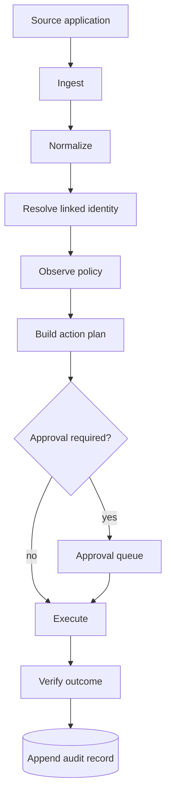

# Architecture

## Status

Foundational architecture for the pre-alpha reference implementation.

## Architectural stance

The People’s Grimoire is a **federated coordination layer**, not a replacement database for every connected application.

Each application keeps its own native model. Connectors translate selected resources and events into a small canonical envelope. Recipes then propose actions according to explicit field authority, conflict, approval, and privacy rules.

### Continuity over interface

The AI or chatbot interface is a **replaceable cognition carrier**, not a canonical state store. Durable identity, topology, provenance, routing, authority rules, procedures, and resumable project state belong in operator-authorized durable carriers when they are required for future work.

The architecture therefore uses a **fresh-host continuity test**: a capable AI with no prior conversation history should be able to enter through the public bootstrap protocol, inspect the authorized durable layers, recover the instance map and operating rules, locate active canonical work, and continue without silently inventing missing state.

Portability of state does not imply identical behavior between models. The requirement is that continuity of the operator’s system must not depend on one vendor’s private model memory or inaccessible chat history.

See [ADR 0006](adr/0006-continuity-over-interface.md).



## Core components

### 1. Connector

A connector is an adapter for one external system.

It may expose capabilities such as:

- discover resources;
- read a resource;
- normalize an incoming change;
- propose a platform-specific operation;
- execute an approved operation;
- verify the resulting state; and
- describe required permissions and rate limits.

Connectors do not decide cross-system policy. They translate and execute.

### 2. Resource reference

A `ResourceRef` identifies an object without importing its full contents into the core.

The initial identity tuple is:

```text
connector + resource_type + external_id
```

A resource may also carry a URL and a public, opaque Grimoire identity link. Sensitive titles or content are not required for identity.

### 3. Canonical event

A `GrimoireEvent` is an immutable statement that a connector observed a change.

The first envelope includes:

- schema version;
- deterministic event identifier;
- source resource reference;
- event kind;
- timestamp;
- selected normalized payload;
- provenance.

The canonical envelope is intentionally small. Connector-specific detail belongs under namespaced payload fields or in a separately stored evidence object.

### 4. Link graph

The link graph records that two resource references participate in the same logical entity.

Examples:

- a Notion project page and a GitHub repository;
- a Notion task and a GitHub issue;
- a decision record and an ADR file;
- a release note page and a GitHub release.

A link does not imply that every field should synchronize.

### 5. Recipe

A recipe is a declarative coordination policy.

A recipe defines:

- trigger;
- matching scope;
- identity resolution;
- field authority;
- transformations;
- conflict behavior;
- approval requirements;
- target actions;
- verification rules; and
- redaction behavior.

Recipes should be portable. Instance-specific identifiers and secrets are injected at deployment time.

### 6. Planner

The planner combines an event, link graph, recipe, and current target state to produce a list of `ProposedAction` objects.

Planning must be side-effect free. A plan should be serializable and reviewable before execution.

### 7. Approval boundary

Each proposed action states whether approval is required.

Approval can eventually be granted through a CLI, web interface, pull request, chat interface, or policy rule. High-impact actions remain human-approved by default.

### 8. Executor

The executor dispatches an approved action to the target connector.

It must:

- verify that the connector is registered;
- enforce idempotency or deduplication;
- record success or failure;
- preserve enough evidence to explain the operation; and
- avoid logging secret or unnecessary content.

### 9. Ledger

The ledger is append-only operational memory.

A production record should include:

- originating event identifier;
- recipe and version;
- action identifier;
- approval evidence;
- target reference;
- precondition;
- execution result;
- timestamp; and
- redacted diagnostic detail.

The pre-alpha runtime uses an in-memory ledger. A durable SQLite implementation is planned first, with optional PostgreSQL support later.

## Plan/apply separation

The most important safety boundary is the separation between **planning** and **application**.

```text
observe -> normalize -> plan -> inspect -> approve -> apply -> verify -> record
```

No connector should hide a write inside discovery, normalization, or planning.

A dry-run uses the same planner and produces the same action identifiers as an applied run. This allows a person or automated policy to approve a specific plan rather than a vague intention.

## Field authority

A resource is not globally authoritative. Authority is assigned per field or semantic concern.

| Concern | Authority | Rationale |
|---|---|---|
| Issue state | GitHub | Development workflow happens in GitHub |
| Long-form project narrative | Notion | Notion is optimized for collaborative documents |
| Decision text | Versioned ADR | Decisions should be reviewable in Git history |
| Friendly display title | Recipe-defined | May vary by interface |
| Cross-system identity | Grimoire link graph | Neither application understands the complete relationship |

When two systems change an authoritative field unexpectedly, the default conflict behavior is **hold and surface**, not last-write-wins.

## Idempotency

Every event and proposed action receives a deterministic identifier.

Connectors should also use platform-supported idempotency keys, conditional updates, ETags, revision identifiers, or precondition checks when available.

Replaying an already completed action must not duplicate a resource or silently overwrite a newer state.

## State model

The first durable state store is expected to contain:

- resource references;
- logical entity links;
- connector cursors;
- recipe versions;
- event fingerprints;
- proposed actions;
- approvals;
- execution records; and
- redacted error records.

Raw document bodies should remain in their source systems unless a recipe explicitly requires a local encrypted cache.

## Deployment modes

### Personal local runtime

A single operator runs the Grimoire on a workstation, home server, or private virtual machine.

### Team runtime

A team operates a shared runtime with separated connector credentials, role-based approvals, and a durable database.

### Embedded interface

An assistant or application invokes the runtime through a local API while the runtime retains policy and credential control.

A mandatory hosted control plane is not part of the architecture.

## Connector capability manifest

Each production connector will publish a machine-readable manifest describing:

- connector name and version;
- supported resource types;
- read and write operations;
- authentication methods;
- minimum permissions;
- rate-limit behavior;
- webhook or polling support;
- idempotency guarantees;
- sensitive fields;
- deletion behavior; and
- test fixture coverage.

## Open architectural questions

The following remain deliberate design questions rather than hidden assumptions:

- Which parts of the canonical schema should become a separate versioned specification?
- Should recipes use YAML, JSON, a constrained expression language, or a combination?
- How should encrypted local content caches be modeled?
- How should distributed team runtimes coordinate approvals and locks?
- Which interoperability standards can be reused without importing unnecessary complexity?
- How should connector conformance tests be packaged?

These decisions will be made through Architecture Decision Records.
