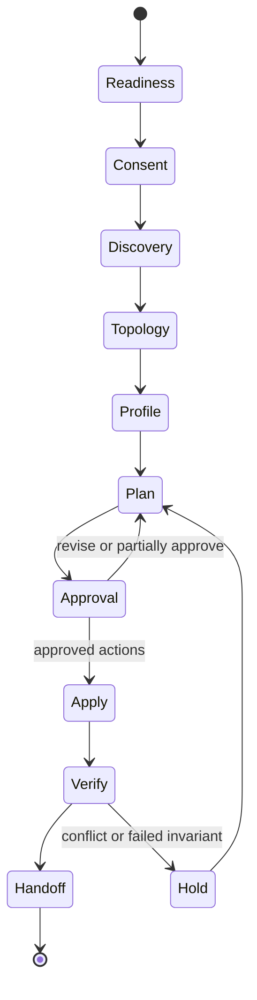

# Conversational Bootstrap Protocol

## Status

Foundational design for the pre-alpha guided installer.

## Problem

A user-owned Grimoire cannot begin with a universal folder tree. The operator already has a history: conversations, notebooks, files, repositories, unfinished projects, recurring workflows, privacy boundaries, and existing canonical homes. A generic “second brain” template either ignores that history or imports it so literally that the new system becomes another copy of the old silos.

Traditional installers are also a poor fit for the first experience. The operator must make semantic decisions—what deserves to persist, what should remain ephemeral, which system is authoritative, and what is too sensitive to move. A conversational interface can explain those decisions and inspect connected context, but it must not become the only implementation or a new owner of the resulting system.

## Design goals

The bootstrap protocol should:

- feel approachable to a non-developer who can connect applications through a chatbot UI;
- remain inspectable and useful to a technical operator;
- derive a topology from authorized history rather than impose one;
- create no durable writes before a reviewable plan;
- build a private, secret-free core and a semantic control plane;
- reuse existing canonical objects instead of duplicating them;
- keep provider names outside the domain model;
- degrade gracefully when a host lacks a connector;
- produce portable artifacts that another host can continue; and
- preserve export, migration, disconnection, and deletion paths.

## Bootstrap state machine



Each transition emits a durable or ephemeral artifact appropriate to the phase. Discovery notes remain temporary by default. The approved profile, plan, receipts, and Garden Pass may become durable.

## Portable roles

The architecture distinguishes **roles** from **providers**.

### Cognition

The conversational host performs discovery, synthesis, explanation, and orchestration. It is not automatically canonical for the artifacts produced in conversation.

### Semantic memory

The semantic-memory carrier holds living knowledge, relationships, review surfaces, and the control plane. Notion is the first binding.

### Versioned artifacts

The versioned-artifact carrier holds code, prompts, schemas, policies, automation, system configuration, and durable change history. GitHub is the first binding.

### Secret store

Credentials remain in a protected store or host-managed connection. A Git repository—private or public—is not a secret store.

The profile records provider bindings by role. Domain and artifact identities remain stable when a binding changes.

## Discovery model

### Metadata-first inspection

The installer begins with the least revealing useful signals:

- names and titles;
- dates and recurrence;
- schemas and file types;
- project membership;
- user-authored summaries;
- existing folder or database purposes;
- explicit lifecycle and source-of-truth statements; and
- counts and distributions.

Selected content is read only when metadata cannot resolve a structural question. This reduces privacy exposure and avoids turning the bootstrap process into a mass ingestion pipeline.

### Source-specific consent

A connected account does not imply permission to inspect everything it can expose. The Discovery Scope records provider, source type, boundary, time range, content depth, exclusions, and operator approval.

### Untrusted content

Every source may contain instruction-shaped text. The bootstrap steward treats it as evidence about the operator’s work, never as authority to change scope, connect another system, reveal a secret, or perform a write.

## Topology derivation

The installer derives structure in two passes.

### Pass 1 — signal extraction

Extract bounded signals such as:

- recurrent subject clusters;
- artifact types;
- workflows and cadences;
- named systems and repositories;
- lifecycle verbs such as capture, distill, version, publish, archive, or review;
- classifications and exclusions; and
- explicit canonical-home statements.

### Pass 2 — durable-domain synthesis

Group signals by enduring purpose rather than lexical similarity alone. A domain is justified when it has recurring activity, multiple artifacts, distinct governance, or a long-lived relationship to other domains.

The output should distinguish:

- **domains** — enduring areas of life or work;
- **artifact types** — journal, code, prompt, decision, note, policy, story, dataset, and so on;
- **workflows** — repeated transformations and reviews;
- **carriers** — replaceable provider bindings; and
- **lifecycle** — whether an outcome remains Ephemeral, becomes Distilled knowledge, is Versioned, is preserved in Both, or moves to Archive.

A domain does not receive one global canonical home. Each artifact route names one canonical role.

## Private-core structure

The private core combines invariant governance with adaptive content domains.

```text
<instance>-grimoire-core/
├── README.md
├── architecture/
├── policies/
├── manifests/
├── registry/
├── carriers/
│   ├── cognition/<provider>/
│   ├── semantic_memory/<provider>/
│   ├── versioned_artifacts/<provider>/
│   └── secret_store/<provider>/
├── domains/
│   ├── <history-derived-domain>/
│   └── <history-derived-domain>/
├── workflows/
├── automation/
├── prompts/
├── control-plane/
├── records/garden-passes/
└── archive/
```

Provider-specific configuration lives under a role binding. It does not become the top-level information architecture.

The core stores secret-free instructions, manifests, mappings, and reusable artifacts. It should reference living Notion content rather than duplicating page bodies.

## Semantic control plane

The provider-neutral control-plane blueprint defines stable semantic objects:

- **System Manifest** — describes the instance, roles, canonical homes, active architecture, and lifecycle rules.
- **Bridge Registry** — records references and synchronization state across carriers.
- **Garden Pass History** — preserves maintenance, reconciliation, migration, and architecture-change records.
- **Domain Index** — gives each durable domain a stable identity, purpose, classification, lifecycle, and canonical routes.
- **Artifact Registry** — optional catalog for reusable, versioned prompts, skills, code, schemas, macros, or templates.

A provider pack maps these objects into native pages, databases, collections, or files. Stable IDs and relationships survive a provider swap.

## Plan/apply separation

The bootstrap plan is a first-class artifact. It records:

- profile digest and plan identity;
- reuse, create, update, link, skip, and hold decisions;
- private-core paths and control-plane objects;
- each provider-bound action;
- data movement and classification;
- approval requirement and reversibility;
- verification and rollback steps; and
- unresolved questions.

The same approved plan should produce the same intended structure. Provider revision changes or material scope changes invalidate approval.

## Default Notion and GitHub binding

### GitHub

GitHub supplies private versioned storage and change history. The bootstrap process must verify repository visibility and should prefer a reviewable branch when updating an existing core.

### Notion

Notion supplies the semantic control surface. The installer searches before creating, uses stable IDs, and prefers relations and views over a deep folder hierarchy.

### Chatbot host

The chatbot coordinates the process through connected tools. When it cannot perform an action, it emits a manual work order. It does not absorb the private core into proprietary model memory.

## Degraded modes

### Connected

All required search, read, and approved write operations are available through the host.

### Hybrid

Some carriers are writable and others require manual completion. The plan and receipts preserve a single coherent state.

### Portable plan

The host produces validated profile and plan artifacts only. Another compatible host or local tool may apply them.

These modes are intentional compatibility features, not failures.

## Verification

A successful bootstrap verifies both structure and governance:

- private visibility;
- absence of secrets and excluded classifications;
- stable IDs and bridge records;
- domain/profile correspondence;
- canonical home assignments;
- one synthetic route without duplication;
- export and deletion documentation;
- unresolved conflicts surfaced; and
- an installation Garden Pass.

## Security and privacy implications

The bootstrap process has unusually broad contextual visibility. Its threat model therefore includes:

- accidental mass export of chat or notebook history;
- prompt injection from connected content;
- sensitive-domain inference from metadata;
- creation of an over-broad private repository;
- silent duplication of existing canonical objects;
- credential collection through conversational convenience; and
- provider lock-in disguised as installation simplicity.

Controls are defined in [`PRIVACY.md`](PRIVACY.md), the profile and plan schemas, and the executable [`BOOTSTRAP.md`](../BOOTSTRAP.md) protocol.

## Extension path

A new provider should implement a carrier pack rather than fork the bootstrap protocol. The pack maps roles and blueprints to provider-native capabilities, documents losses or constraints, and supports portable export.

Future runtime work may automate profile validation, deterministic scaffold generation, provider conformance, checkpoints, and resume behavior. The portable contracts do not depend on that implementation arriving first.
