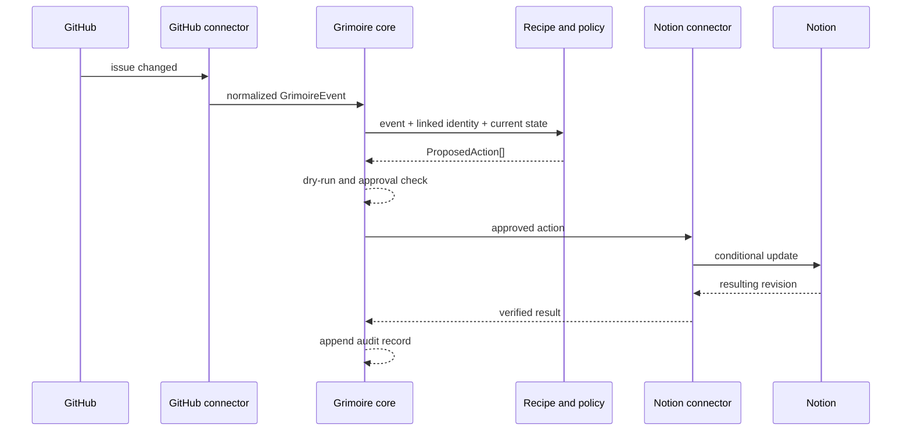

# Notion ↔ GitHub MVP

## Purpose

The first implementation proves that two semantically different applications can participate in one project memory without blind mirroring or exposing private content.

GitHub remains the native home of versioned code work. Notion remains the native home of long-form context and flexible knowledge structures. The Grimoire links them through explicit identities, events, and recipes.

## Founding domain map

| Logical entity | Notion representation | GitHub representation |
|---|---|---|
| Project | Project page or database row | Repository or GitHub Project |
| Work item | Task or database row | Issue |
| Decision | Decision page | ADR Markdown file |
| Change | Project update or changelog entry | Pull request, merge commit, or release |
| Artifact | Linked page or file | Repository file, discussion, release asset |
| Person | Mention or people property | User or team reference |

This table describes relationships, not guaranteed one-to-one equivalence.

## Initial authority model

| Concern | Initial authority | Notes |
|---|---|---|
| Repository identity | GitHub | Repository owner/name and immutable ID originate in GitHub |
| Issue number and state | GitHub | Development workflow remains native to GitHub |
| Issue-linked task status | GitHub-derived | Notion may display it but does not overwrite it in v0.1 |
| Project narrative | Notion | Long-form context remains native to Notion |
| Decision body | ADR after publication | Drafting may begin in Notion; accepted text becomes versioned |
| Cross-system link | Grimoire | Stored as an explicit relationship with provenance |
| Human-friendly aliases | Instance recipe | May differ by interface |
| AI-generated summary | Derived | Never authoritative without a separate decision |

## MVP recipes

### Recipe A: Link a project

**Trigger:** operator supplies a Notion project reference and GitHub repository reference.

**Plan:**

1. Verify both resources are readable.
2. Create one logical project entity.
3. Record the two resource references.
4. Propose reciprocal links where platform capabilities permit.
5. Write an audit record.

**Write behavior:** approval required.

### Recipe B: GitHub issue → Notion task view

**Trigger:** an issue is created or updated in a linked repository.

**Plan:**

1. Normalize the issue event.
2. Resolve an existing linked Notion task by opaque mapping.
3. If none exists, propose creation.
4. Map selected fields according to the authority matrix.
5. Hold on ambiguous identity or conflicting manual edits.

**Write behavior:** creation requires approval during v0.1; status refresh may later be policy-approved.

### Recipe C: Notion decision → ADR proposal

**Trigger:** a linked Notion decision enters a configured “Ready for review” state.

**Plan:**

1. Read only the configured decision fields.
2. Generate a proposed ADR file using a deterministic path.
3. Open a pull request rather than writing directly to the default branch.
4. Link the pull request back to the Notion decision.
5. Treat merged ADR text as authoritative.

**Write behavior:** pull request creation requires approval.

### Recipe D: Merged pull request → project update

**Trigger:** a pull request merges in a linked repository.

**Plan:**

1. Normalize merge metadata.
2. Identify the linked project.
3. Propose a concise, provenance-linked project update.
4. Exclude private review comments unless explicitly configured.
5. Record the merge and update identifiers.

**Write behavior:** plan-only in v0.1; controlled append may be enabled later.

## Event flow

## Identity strategy

The MVP uses an internal opaque link record rather than embedding personal or workspace structure in public identifiers.

Where reciprocal links are written into SaaS properties, they contain only:

- a public URL already visible to the authorized operator; or
- an opaque Grimoire entity identifier.

Names and titles are display metadata, not identity keys.

## Conflict behavior

The default is **hold and surface**.

The MVP must not use last-write-wins for meaningful fields. A conflict record includes:

- field;
- current source value fingerprint;
- current target value fingerprint;
- authority rule;
- last successful synchronization;
- proposed resolution; and
- whether human review is required.

## Required connector capabilities

### GitHub

- Read repository metadata.
- Read issue and pull request metadata.
- Observe changes through polling or events.
- Create a branch, commit, or pull request for ADR proposals.
- Verify resulting commit and pull request references.

### Notion

- Read configured page or database properties.
- Read selected page content only when a recipe requires it.
- Create or update configured properties.
- Write reciprocal links.
- Verify resulting page revision or last-edited timestamp.

Exact authentication and event mechanisms will follow official platform capabilities at implementation time.

## v0.1 success criteria

- [ ] A project can be linked without storing raw content in the link graph.
- [ ] GitHub issue changes produce deterministic canonical events.
- [ ] A Notion task action can be planned without being executed.
- [ ] The same event replay does not create a duplicate action.
- [ ] Every write requires approval unless a recipe explicitly opts into a tested low-risk policy.
- [ ] A merged ADR pull request can be linked back to its originating decision.
- [ ] Logs and fixtures contain no live credentials or personal content.
- [ ] The operator can export and delete local link and ledger data.

## Excluded from v0.1

- General-purpose full-page mirroring.
- Comment synchronization.
- Attachment copying.
- Automatic deletion across systems.
- Organization-wide discovery.
- Unreviewed AI-generated changes.
- Multi-tenant hosted operation.
